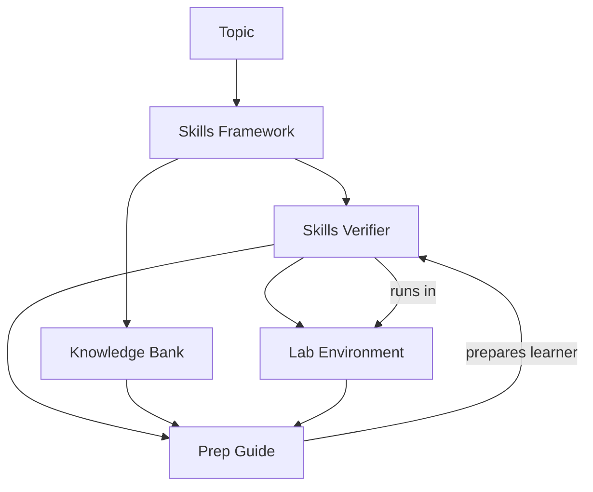

Perfect — let’s roll back to that version. Here’s the **cleaned-up README draft** you liked:

- Short intro
- Summary table right at the top
- No acronyms, no “blueprint” everywhere
- Each document described in detail with role + connections

I’ve added the **Mermaid diagram** you requested at the end so the flow is visual too.

---

# 📚 Skill System Stack

This repo defines a **5-part system** for teaching, practicing, and verifying skills in a consistent way.
Each document plays a distinct role but links with the others to create an end-to-end flow — from defining skills, to preparing learners, to verifying them in a reproducible lab environment.

---

## ✅ The Five-Document Ecosystem

| Document             | Inputs                                               | Outputs                                  | Primary Audience    |
| -------------------- | ---------------------------------------------------- | ---------------------------------------- | ------------------- |
| **Skills Framework** | Topic                                                | Leveled skill list                       | Authors             |
| **Skills Verifier**  | Skills Framework, MCP tools                          | Probes, pass/fail rules, fixtures needed | Verifiers           |
| **Knowledge Bank**   | Skills Framework                                     | Question bank tied to skills             | Instructors         |
| **Lab Environment**  | Skills Verifier fixtures                             | Scripts, Makefile, ZIP                   | Learners, Verifiers |
| **Prep Guide**       | Framework, Verifier, Knowledge Bank, Lab Environment | Prep pathways distinct from verification | Instructors         |

---

## 1. 🧩 Skills Framework

**Purpose:** Defines _what_ learners should know and do.

- Progressive levels: Exploring → Applying → Building → Advancing → Innovating
- Skills written with Bloom’s verbs, 7–13 per level
- Professional/enterprise focus

**Feeds into:**

- Skills Verifier (defines how to measure each skill)
- Knowledge Bank (recall questions)
- Lab Environment (fixtures for hands-on practice)
- Prep Guide (chooses prep exercises aligned to level)

---

## 2. 🔎 Skills Verifier

**Purpose:** Defines _how_ to measure skills.

- Maps skills to verification methods (auto, manual, knowledge check)
- Lists probes (commands, file checks, dataset queries)
- Documents pass/fail criteria
- Notes reset/reproducibility conditions

**Feeds into:**

- Lab Environment (fixtures to prepare for verification)
- Prep Guide (designs practice drills, distinct from verification probes)

---

## 3. 📝 Knowledge Bank

**Purpose:** Provides **reusable knowledge questions**.

- Question types: multiple choice, true/false, short answer
- Each question tied directly to a skill in the Skills Framework
- Includes correct answers, distractors, and hints

**Feeds into:**

- Skills Verifier (for verifiable recall checks)
- Prep Guide (for warm-up questions that differ from verification set)

---

## 4. 🧪 Lab Environment

**Purpose:** Provides a **sandbox** for skill practice and verification.

- Defines fixtures: repos, datasets, configs
- Provides scripts (`bootstrap.sh`, `reset.sh`, `verify.sh`)
- Orchestrates with `Makefile`
- Packages into a distributable ZIP

**Feeds into:**

- Skills Verifier (fixtures for auto-verification)
- Prep Guide (practice activities inside the same environment, with variations)

---

## 5. 👩‍🏫 Prep Guide

**Purpose:** Guides learners in **preparing for verification**.

- Makes initial level assessment (background + varied Knowledge Bank questions)
- Places learner into a skill level band (Exploring → Innovating)
- Assigns **distinct prep exercises** (different from verification, but aligned)
- Uses **Lab Environment** with small variations
- Encourages reflection and self-assessment

**Feeds from:**

- Skills Framework (skills to target)
- Skills Verifier (areas to prepare, without reusing probes)
- Knowledge Bank (sample questions, re-worded for practice)
- Lab Environment (sandbox for prep labs)

---

# 🔄 How They Fit Together

1. **Skills Framework** = the map of skills
2. **Skills Verifier** = the measuring system
3. **Knowledge Bank** = the quiz bank
4. **Lab Environment** = the sandbox
5. **Prep Guide** = the practice coach

👉 Learner flow:

- Prep Guide starts with warm-up questions (Knowledge Bank) + background
- Places learner on Skills Framework level
- Recommends prep exercises (distinct from verification, but in Lab Environment)
- When ready → learner takes verification using Skills Verifier in Lab Environment

---

# 📎 Cross-References in Docs

- **Skills Framework** → “See Prep Guide for how these skills are introduced and practiced before verification.”
- **Skills Verifier** → “Prep Guides may design practice activities informed by this map, but must not reuse probes.”
- **Knowledge Bank** → “Sample items may be adapted by instructors for warm-up assessment (see Prep Guide).”
- **Lab Environment** → “The same environment is used for practice (Prep Guide) and verification (Skills Verifier), with varied tasks.”
- **Prep Guide** → “This document draws on Skills Framework, Skills Verifier, Knowledge Bank, and Lab Environment.”

---

# ⚙️ CLI Usage

```bash
python main.py init <slug> [--force]

# Render the skills framework
python main.py render <slug> skills-framework --topic "<Topic Name>"

# Render the other artifacts
python main.py render <slug> knowledge-bank --topic "<Topic Name>"
python main.py render <slug> lab-environment --topic "<Topic Name>"
python main.py render <slug> skills-verifier --topic "<Topic Name>" --mcp-tools-fn example-bash-mcp.json
python main.py render <slug> prep-guide --topic "<Topic Name>"
```

---

# 📈 Diagram



# Document Samples

Here are examples of the templates for each artifact. These can also be found in the `artifacts/ directory` but are repeated here to make it easy to paste this entire README into chatgpt.

# Reference Templates

These are the templates used to generate each artifact. Leave these template variables in place when copying.

## SF = “what to learn”

<SF TEMPLATE>
{{skill_framework}}
</SF TEMPLATE>

## VCM = “how to test”

<VCM TEMPLATE>
{{skill_framework_verifier}}
</VCM TEMPLATE>

## KCB = “knowledge checks”

<KCB TEMPLATE>
{{knowledge_check}}
</KCB TEMPLATE>

## LEB = “sandbox”

<LEB TEMPLATE>
{{lab_environment}}
</LEB TEMPLATE>

## PIB = “prep coach”

<PIB TEMPLATE>
{{preparation_instructor}}
</PIB TEMPLATE>
